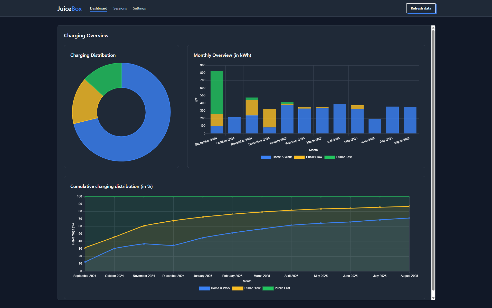
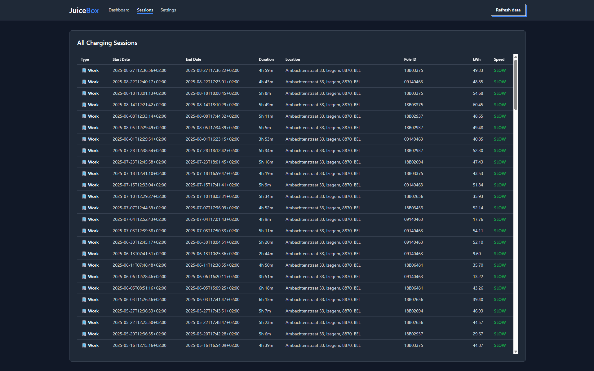

# JuiceBox - EV Charging Analytics

**JuiceBox** is a Chrome extension that tracks and analyzes your electric vehicle charging sessions from Shell Recharge stations. 
Get insights into your charging patterns with detailed statistics and beautiful visualizations.

## ⚡ Features

### 📊 **Analytics Dashboard**
- **Charging Distribution**: See how your charging is split between home/work vs public locations
- **Monthly Overview**: Track kWh consumption month by month
- **Cumulative Trends**: Visualize your charging patterns over time

### 📈 **Session Categorization**
- Automatically categorizes charging sessions by speed (fast/slow charging)
- Detects location types (work / public) based on configurable settings
- Provides detailed session history with location and charging details

## 🚀 Installation

### From Chrome Web Store
*Work in progress - awaiting review*

### Download Release
1. Go to the [Releases](https://github.com/brayunm/JuiceBox/releases) page
2. Download the latest `juicebox-extension.zip`
3. Extract the zip file
4. Open Chrome and go to `chrome://extensions/`
5. Enable **Developer mode** (toggle in top right)
6. Click **Load unpacked** and select the extracted folder
7. The JuiceBox extension should now appear in your extensions

## How to Use

1. **Install the extension** following the steps above
2. **Load data from Shell Recharge** - Click on the "Refresh Data" button in the header.
3. **Log in to Shell Recharge** - Click on the "Login" button in the header.
4. **Automatic data collection** - The extension will automatically detect and collect your charging session data
5. **View analytics** - Click the JuiceBox extension icon to open the analytics dashboard

## 🎨 Screenshots

### Dashboard View

### Sessions View  
  

## 🔒 Privacy & Security

- **Local data only**: All charging session data is stored locally in your browser
- **No external servers**: Data never leaves your device
- **Minimal permissions**: Only accesses Shell Recharge websites when needed

## 🤝 Contributing

Found a bug or have a feature request?
Please [open an issue](https://github.com/brayunm/JuiceBox/issues) - contributions and feedback are welcome!

## 🆘 Support

Having issues? [Open an issue](https://github.com/brayunm/JuiceBox/issues).